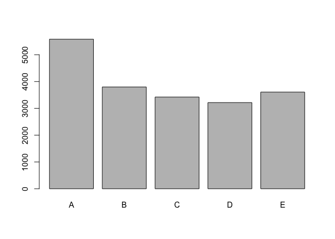
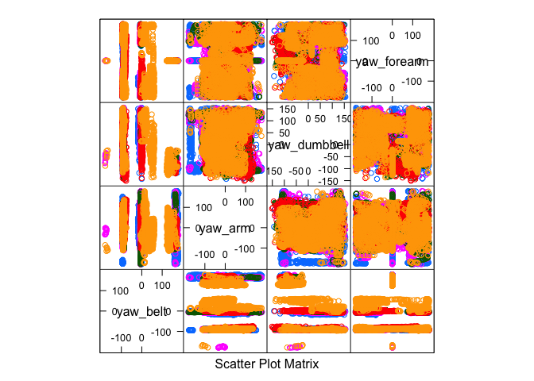

# Machine Learning Course Project 12/27/15
CSD  
December 26, 2015  

In this report we develop a model to predict the way that a person completed a particular exercise. The ways they performed the exercise range from A - E.

First we load the caret library and the training and test data that was provided:


```r
library(caret)
```

```
## Warning: package 'caret' was built under R version 3.1.3
```

```
## Loading required package: lattice
## Loading required package: ggplot2
```

```r
library(lattice)
library(ggplot2)
training = read.csv("data/pml-training.csv", header=TRUE)
test = read.csv("data/pml-testing.csv", header=TRUE)
```

We have a lot of possible features from this data. Quick data exploration shows the # observations and distribution of classes for our training data from A - E:


```r
nrow(training)
```

```
## [1] 19622
```

 

We have a lot of training data and we need to do cross-validation, so we will break up our training data into a test (25%) and training set (75%) and then use the test set provided as cross-validation.


```r
inTrain = createDataPartition(y=training$classe, p=0.75, list=FALSE)
trainingData = training[inTrain,]
testData = training[-inTrain,]
```

Now that we have training and test data we will do some preliminary data exploration to see which fit a model. Running summary(trainingData) shows that there are a lot of features that are majority "NAs" so we will just remove those from consideration.


```r
colsToRemove <- c("stddev_yaw_forearm", "var_yaw_forearm", "avg_yaw_forearm", "var_pitch_forearm", "stddev_pitch_forearm", "avg_pitch_forearm", "var_roll_forearm", "stddev_roll_forearm", "avg_roll_forearm", "var_accel_forearm", "amplitude_pitch_forearm", "amplitude_roll_forearm", "min_pitch_forearm", "min_roll_forearm", "max_picth_forearm", "max_roll_forearm", "var_yaw_dumbbell", "stddev_yaw_dumbbell", "avg_yaw_dumbbell", "var_pitch_dumbbell", "stddev_pitch_dumbbell", "avg_pitch_dumbbell", "var_roll_dumbbell", "stddev_roll_dumbbell", "avg_roll_dumbbell", "var_accel_dumbbell", "amplitude_pitch_dumbbell", "amplitude_roll_dumbbell", "min_pitch_dumbbell", "min_roll_dumbbell", "max_picth_dumbbell", "max_roll_dumbbell", "amplitude_yaw_arm", "amplitude_pitch_arm", "amplitude_roll_arm", "min_yaw_arm", "min_pitch_arm", "min_roll_arm", "max_yaw_arm", "max_picth_arm", "max_roll_arm", "var_yaw_arm", "stddev_yaw_arm", "avg_yaw_arm", "var_pitch_arm", "stddev_pitch_arm", "avg_pitch_arm", "var_roll_arm", "stddev_roll_arm", "avg_roll_arm", "var_yaw_belt", "stddev_yaw_belt", "avg_yaw_belt", "var_pitch_belt", "stddev_pitch_belt", "avg_pitch_belt", "var_roll_belt", "stddev_roll_belt", "avg_roll_belt", "var_total_accel_belt", "amplitude_pitch_belt", "amplitude_roll_belt", "min_pitch_belt", "min_roll_belt", "max_picth_belt", "max_roll_belt")
trainingData = trainingData[,!(names(trainingData) %in% colsToRemove)]
```
Now we will see which features might be relevant. Let's look at just the "yaw" columns.


```r
names(trainingData)
```

```
##  [1] "id"                      "user_name"              
##  [3] "raw_timestamp_part_1"    "raw_timestamp_part_2"   
##  [5] "cvtd_timestamp"          "new_window"             
##  [7] "num_window"              "roll_belt"              
##  [9] "pitch_belt"              "yaw_belt"               
## [11] "total_accel_belt"        "kurtosis_roll_belt"     
## [13] "kurtosis_picth_belt"     "kurtosis_yaw_belt"      
## [15] "skewness_roll_belt"      "skewness_roll_belt.1"   
## [17] "skewness_yaw_belt"       "max_yaw_belt"           
## [19] "min_yaw_belt"            "amplitude_yaw_belt"     
## [21] "gyros_belt_x"            "gyros_belt_y"           
## [23] "gyros_belt_z"            "accel_belt_x"           
## [25] "accel_belt_y"            "accel_belt_z"           
## [27] "magnet_belt_x"           "magnet_belt_y"          
## [29] "magnet_belt_z"           "roll_arm"               
## [31] "pitch_arm"               "yaw_arm"                
## [33] "total_accel_arm"         "var_accel_arm"          
## [35] "gyros_arm_x"             "gyros_arm_y"            
## [37] "gyros_arm_z"             "accel_arm_x"            
## [39] "accel_arm_y"             "accel_arm_z"            
## [41] "magnet_arm_x"            "magnet_arm_y"           
## [43] "magnet_arm_z"            "kurtosis_roll_arm"      
## [45] "kurtosis_picth_arm"      "kurtosis_yaw_arm"       
## [47] "skewness_roll_arm"       "skewness_pitch_arm"     
## [49] "skewness_yaw_arm"        "roll_dumbbell"          
## [51] "pitch_dumbbell"          "yaw_dumbbell"           
## [53] "kurtosis_roll_dumbbell"  "kurtosis_picth_dumbbell"
## [55] "kurtosis_yaw_dumbbell"   "skewness_roll_dumbbell" 
## [57] "skewness_pitch_dumbbell" "skewness_yaw_dumbbell"  
## [59] "max_yaw_dumbbell"        "min_yaw_dumbbell"       
## [61] "amplitude_yaw_dumbbell"  "total_accel_dumbbell"   
## [63] "gyros_dumbbell_x"        "gyros_dumbbell_y"       
## [65] "gyros_dumbbell_z"        "accel_dumbbell_x"       
## [67] "accel_dumbbell_y"        "accel_dumbbell_z"       
## [69] "magnet_dumbbell_x"       "magnet_dumbbell_y"      
## [71] "magnet_dumbbell_z"       "roll_forearm"           
## [73] "pitch_forearm"           "yaw_forearm"            
## [75] "kurtosis_roll_forearm"   "kurtosis_picth_forearm" 
## [77] "kurtosis_yaw_forearm"    "skewness_roll_forearm"  
## [79] "skewness_pitch_forearm"  "skewness_yaw_forearm"   
## [81] "max_yaw_forearm"         "min_yaw_forearm"        
## [83] "amplitude_yaw_forearm"   "total_accel_forearm"    
## [85] "gyros_forearm_x"         "gyros_forearm_y"        
## [87] "gyros_forearm_z"         "accel_forearm_x"        
## [89] "accel_forearm_y"         "accel_forearm_z"        
## [91] "magnet_forearm_x"        "magnet_forearm_y"       
## [93] "magnet_forearm_z"        "classe"
```

```r
featurePlot(x=trainingData[, c("yaw_belt", "yaw_arm", "yaw_dumbbell", "yaw_forearm")  ], y = trainingData$classe, plot="pairs")
```

 


Now we will make a model. 

```r
set.seed(1234)
#modelFit = train(classe ~., data=trainingData, method="glm")
#modelFit
```

Now that we have a model we will make our predictions for the test data.

```r
#predictions = predict(modelFit, newdata=testData)
#predictions
```

And we make a confusion matrix to see how accurate our predictions were and what our out of sample error rate is. 

```r
#confusionMatrix(predictions, testData$type)
```

This is having some errors but that is the basic idea.
